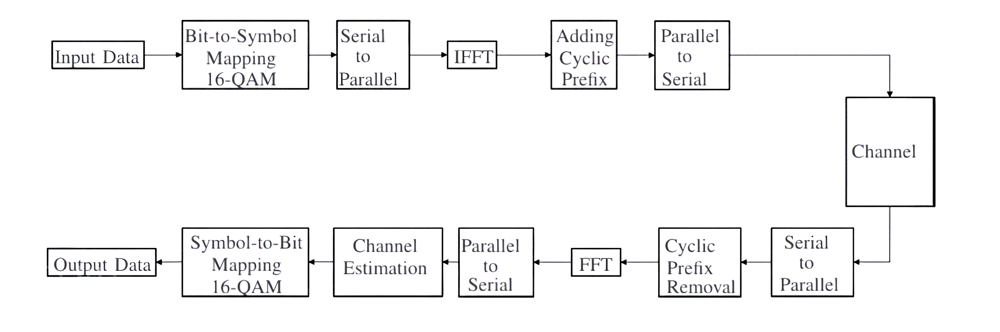

# OFDM Communication System Simulation with 16-QAM Modulation

<!-- 📡 Block Diagram -->

  

## 🚀 Project Overview  
This MATLAB project provides a complete simulation of an Orthogonal Frequency Division Multiplexing (OFDM) system using 16-QAM modulation. It demonstrates the full digital communication pipeline—from random bit generation, 16-QAM symbol mapping, OFDM modulation using IFFT, cyclic prefix addition, transmission over an AWGN channel, and demodulation with BER evaluation.

## ✨ Key Features  
- Random bit generation  
- 16-QAM modulation & demodulation  
- OFDM with IFFT and cyclic prefix  
- AWGN channel model  
- BER vs. SNR performance evaluation  
- Constellation diagrams for received symbols

<!-- 🎯 Constellation Diagrams -->

  
  

## 🛠️ Requirements  
- MATLAB (R2018b or newer)

## ▶️ How to Run  
1. Clone this repository  
2. Open `ofdm_simulation.m` in MATLAB  
3. Run the script to generate results and plots  
4. Modify parameters like SNR, number of subcarriers, or data size to experiment

## 📚 Learning Purpose  
OFDM is a foundational technology in modern wireless systems like Wi-Fi, LTE, and 5G. This simulation provides a clear and visual way to understand its inner workings.

---

*Feel free to star ⭐ this repo or contribute to improvements!*
